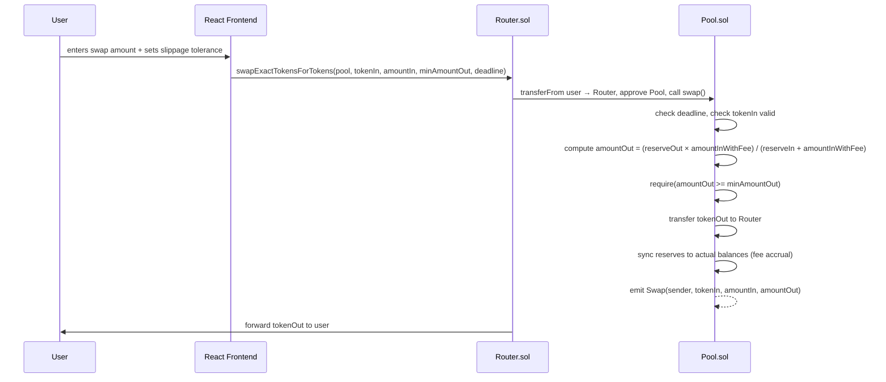

# AMM-DEX

Centralized exchanges hold your tokens in custody and require active market makers to post and manage orders. When a market maker pulls liquidity, spreads widen and the book becomes unusable. A constant-product AMM eliminates both problems: liquidity is locked in a smart contract (no custodial risk), and price is determined by a formula rather than a human posting orders. Anyone can provide liquidity and earn fees proportional to their share of the pool. This is a ground-up implementation of that mechanism — Pool, Router, and LP token contracts written in Solidity, tested with Hardhat, and connected to a React frontend on Sepolia testnet.

---

## How it works

### The x·y=k invariant

The pool holds reserves of two tokens: `reserveA` and `reserveB`. Every swap must leave the product `reserveA × reserveB` at least as large as before (larger, in practice, because of the fee). This invariant means the contract never runs out of either token — it just makes each successive unit exponentially more expensive as the reserve drains. Price is not set; it emerges from the ratio of reserves.

When liquidity is thin, the invariant punishes large swaps heavily. A 10-token swap in a pool with 100-token reserves moves price far more than the same swap in a 10,000-token pool. This is price impact, and it's why `minAmountOut` exists.

### LP token minting

**First deposit:** `liquidity = sqrt(amountA × amountB)`

The geometric mean is used for the initial mint rather than either amount alone. This makes the starting LP supply independent of which token you call A and which you call B, and prevents the initial depositor from manipulating the implied price by depositing in a skewed ratio.

**Subsequent deposits:** `liquidity = min(amountA / reserveA, amountB / reserveB) × totalSupply`

Each LP token represents a proportional claim on both reserves. If you provide 10% of the liquidity at deposit time, you hold 10% of all LP tokens and can redeem 10% of whatever is in the pool when you withdraw — including any fees accrued since.

### Swap fee

Each swap applies a 0.3% fee:

```
amountInWithFee = amountIn × 997 / 1000
amountOut = (reserveOut × amountInWithFee) / (reserveIn + amountInWithFee)
```

The fee is not extracted to a separate address. After transferring `amountOut` to the caller, the contract syncs its reserve values to its actual token balances:

```solidity
reserveA = tokenA.balanceOf(address(this));
reserveB = tokenB.balanceOf(address(this));
```

Because `amountIn` landed in the contract but only `amountOut` left, the reserves grow slightly. This growth is distributed to all LP holders proportionally — when someone calls `removeLiquidity`, they receive slightly more than they deposited, because their LP tokens now represent a larger pool.

### Slippage protection

```solidity
require(amountOut >= minAmountOut, "Slippage exceeded");
```

The caller computes the minimum acceptable output before submitting the transaction. If the pool state moves between the transaction being signed and being mined (because another swap executed first), the transaction reverts rather than filling at a worse price than intended.

A deadline parameter provides the same protection against a transaction sitting in the mempool for too long:

```solidity
require(block.timestamp <= deadline, "Expired");
```

---

## Architecture

### Contracts

| Contract | Purpose |
|----------|---------|
| `Pool.sol` | Core AMM logic — holds reserves, issues LP tokens, executes swaps. One pool per token pair. |
| `Router.sol` | Convenience wrapper — handles `transferFrom` and `approve` on behalf of the user so the frontend only needs to approve the Router, not each Pool directly. |
| `LPToken.sol` | ERC-20 token representing a liquidity position in a pool. Only the pool that created it can mint or burn. |
| `TestToken.sol` | Standard ERC-20 used to populate the pool on testnet; not part of the production system. |

### Flow diagram



### Hardhat test suite

7 tests in `test/pool.test.js`, all passing:

1. **Adds initial liquidity** — verifies `reserveA` and `reserveB` are set correctly after first deposit
2. **Swaps tokenA for tokenB** — confirms user balance of tokenB increases after swap
3. **Removes liquidity** — burns all LP tokens, verifies both reserves drain to 0
4. **Reverts when slippage is exceeded** — passes an impossibly high `minAmountOut`, expects `"Slippage exceeded"` revert
5. **Reverts when deadline has passed** — passes deadline `= 1` (Unix epoch), expects `"Expired"` revert
6. **Router swaps tokens correctly** — end-to-end test through the Router contract, confirms user receives output tokens
7. **LPs earn fees over time** — LP deposits, user swaps (generating fee), LP withdraws and receives more tokenA than originally deposited

### React frontend

Built with React 18 + Vite + Ethers.js v6 + MetaMask. Lets users:
- Connect wallet
- Approve and add liquidity to a pool
- Swap between tokenA and tokenB with configurable slippage tolerance
- View current pool reserves and LP token balance

---

## Deployment

**Sepolia testnet** — addresses printed by `scripts/deploy.js` on deployment. Add them to a `.env` file or the frontend config after running the deploy script.

**Frontend** — deployed on Vercel. Live link in the repository description.

---

## Tech stack

| Technology | Why |
|------------|-----|
| **Solidity 0.8.24** | Built-in overflow protection; `immutable` keyword reduces gas cost for token addresses read on every swap |
| **OpenZeppelin ReentrancyGuard** | Prevents reentrant calls on `swap`, `addLiquidity`, and `removeLiquidity` — critical when the contract calls external token contracts |
| **OpenZeppelin ERC20** | Audited, standard token implementation for LPToken; no reason to write it from scratch |
| **Hardhat** | Local EVM, TypeScript test runner, and Sepolia deployment in a single toolchain |
| **Ethers.js v6** | Current major version; cleaner `parseEther` API and better TypeScript types than v5 |
| **React 18 + Vite** | Fast local dev server; no config overhead compared to CRA |
| **MetaMask** | Standard browser wallet injector; no additional wallet library needed for a two-token testnet demo |
| **Sepolia** | Active Ethereum testnet with accessible faucets; Goerli was deprecated |

---

## Local development

### Prerequisites

- Node.js 18+
- MetaMask browser extension

### Setup

```bash
git clone https://github.com/NileshBarandwal/AMM-DEX
cd AMM-DEX
npm install
```

Create a `.env` file in the root:

```
SEPOLIA_RPC_URL=https://sepolia.infura.io/v3/<your-key>
PRIVATE_KEY=<your-wallet-private-key>
```

### Compile contracts

```bash
npx hardhat compile
```

### Run tests

```bash
npx hardhat test
```

### Deploy to local Hardhat network

```bash
# Terminal 1 — start local node
npx hardhat node

# Terminal 2 — deploy
npx hardhat run scripts/deploy.js --network localhost
```

Copy the printed contract addresses. You'll need them to configure the frontend.

### Deploy to Sepolia

```bash
npx hardhat run scripts/deploy.js --network sepolia
```

### Start the frontend

```bash
cd frontend
npm install
npm run dev
```

Update the contract addresses in the frontend config to match your deployment output.

---

## Test coverage

| Test | What it verifies |
|------|-----------------|
| Initial liquidity | `reserveA` and `reserveB` match deposited amounts; LP tokens minted as geometric mean |
| Swap A → B | User receives tokenB; pool reserves shift in accordance with constant-product formula |
| Remove liquidity | All LP tokens burned; both reserves return to 0; tokens returned to LP |
| Slippage revert | `minAmountOut` higher than formula output causes revert with `"Slippage exceeded"` |
| Deadline revert | Expired deadline causes revert with `"Expired"` before any state change |
| Router swap | End-to-end path: user → Router → Pool → user; output token lands in correct wallet |
| Fee accrual | LP withdraws more tokenA than deposited after swap activity in the pool |

---

## Known limitations

This implements the core AMM loop for two tokens with a fixed fee. A production AMM would add:

- **MEV protection** — this contract is vulnerable to sandwich attacks. A searcher can front-run a large swap, let it move the price, then back-run to pocket the difference. Mitigations include commit-reveal schemes, private mempools, or time-weighted average price checks.
- **Multi-hop routing** — swapping tokenA for tokenC when only A/B and B/C pools exist requires the Router to chain swaps. The current Router handles a single pool.
- **Concentrated liquidity** — Uniswap v3 lets LPs specify a price range for their liquidity, dramatically improving capital efficiency. This implementation deposits liquidity across the entire price curve (0 to ∞).
- **Oracle price feeds** — a time-weighted average price (TWAP) oracle lets other contracts read a manipulation-resistant price from this pool. Not implemented.
- **Factory contract** — a Factory deploys new Pool contracts on demand and maintains a registry of all pairs. Currently pools are deployed manually via the deploy script.
- **Governance and fee tiers** — production AMMs allow governance to adjust fees per pool or redirect a portion of fees to a protocol treasury.
